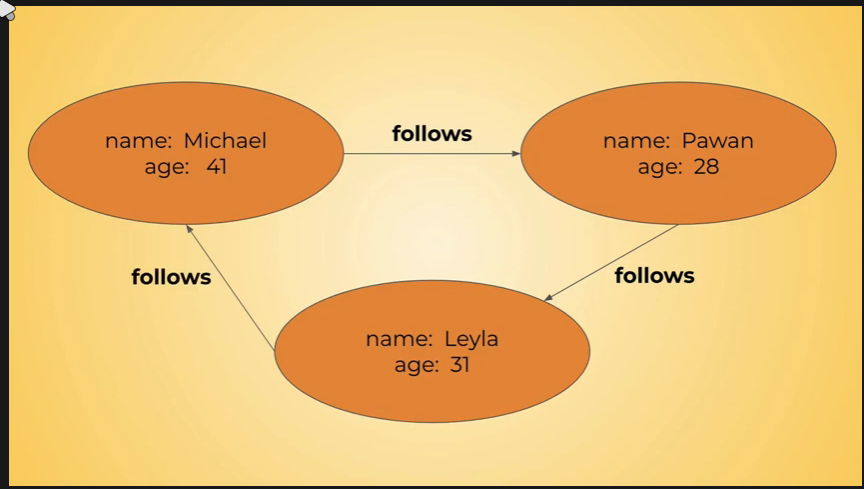

# dgraph description

This is explanation for dgraph DB, how to run, how to use and ...

## Getting Start

For **development** mode start with standalone image for docker dgraphDB this image is useful for just development environment.

```bash
docker run --rm -it -p 8080:8080 -p 9080:9080 -p 8000:8000 -v ~/dgraph:/dgraph dgraph/standalone:v20.11.1
```

* we will expose 3 different ports:
  * 8000 web-ui
  * 8080 for rest api
  * 9080 for GRPC api

## Fundamentals

* For query on Dgraph we should use **Graphql+-** and for mutations we should use **json** or **RDF format**.
* In graph database concept or entities are represented as nodes.
  


* Edge between to entities represented as relation between nodes.

* In this pic we have two properties and they will called Predicates.
* The edge between (in here is follows) will called Predicates as well.
  


## First Commands

### Create

* For mutations we should use **json** or **RDF format**.
* For create new entities just like pictures in previous sections, we can use following commands:

```bash
{
  "set":
    [
      {
        "name": "Hamid",
        "age": "27",
        "follows":[
          {
          "name":"Natalie",
          "age":"??"
          }
        ]
      }
    ]
}
```

### Query

* For query on Dgraph we should use **Graphql+-**.
* Query language in DGraph is in graphql.
* This command will create two separated entities, but with connected UID.
* For query for this two commands:

```bash
{
  people(func: has(follows)){
    name
    age
    follows{
      name
    }
  }
}
```

* In this command people is name of query and it is totally optional.

* func has a mount of command you can see them in following link blow:
  * <https://dgraph.io/docs/query-language/functions/#sidebar>

* You can also search by UID like this:

```bash
{
  q(func: uid(0x3<this is id of one node>)){
    name
    age
    follows{
      name
    }
  }
}
```

* If you wanna fetch more node simply give more ids:

```bash
{
  q(func: uid(0x3,0x2)){
    name
    age
    follows{
      name
    }
  }
}
```

* When we have loop relation nodes like this:
  
  * one way and the simplest way to doing a search and traversal you can do like this:

```bash
{
  q(func: uid(0x3,0x2)){
    name
    age
    follows{
      name
      age
      follows{
        name
        age
        follows{
          name
          age
        }
      }
    }
  }
}
```

* another way of doing recursive traversals:
  
```bash
{
  q(func: uid(0x3,0x2)) @recurse(depth:5, loop: true){
    name
    age
    follows{
      name
      age
    }
  }
}
```

* You can filter one field by greater than or less than func but it required to indexed on that field you wanna filter:

```default
{
  q(func: gt(rating,4.0)){
    author_name
    rating
    published{
      title
      likes
      tagged{
        tag_name
      }
    }
  }
}
```

```default
{
  q(func: lt(rating,4.0)){
    author_name
    rating
    published{
      title
      likes
      tagged{
        tag_name
      }
    }
  }
}
```

* You can also filter on the edge too.

```default
{
  q(func: gt(rating,4.0)){
    author_name
    rating
    published @filter(gt(dislikes,10)){
      title
      likes
      tagged{
        tag_name
      }
    }
    
  }
}
```

* reverse traversals, when you have a child and want to find parent you will do this.

```default
{
  q(func: has(tag_name)){
    tag_name
    ~tagged{
      title
    }
  }
}
```

```default
{
  q(func: has(tag_name)){
    tag_name
    ~tagged{
      name: title
      ~published{
        name: author_name
      }
    }
  }
}
```

* If you want see some name in graph in nodes you can do this by changing aliases.

```default
{
  q(func: has(tag_name)){
    tag_name
    ~tagged{
      name: title
    }
  }
}
```

* In term index we can search for terms by 3 functions: **anyofterms** - **allofterms** - **eq**. **anyofterms** and **allofterms** are case insensitive.
  * allofterms(tag_name,"hi Javascript devrel") means: all tag_name which includes **hi** and **Javascript** and **devrel**.
  * anyofterms(tag_name,"hi Javascript devrel") means: all tag_name which includes **hi** or **Javascript** or **devrel**.

```default
{
  q(func: allofterms(tag_name,"hi Javascript devrel")){
    tag_name
    ~tagged{
      name: title
      ~published{
        name: author_name
      }
    }
  }
}
```

### Update

* It is just like Create command but you need pass uid as well:

```bash
{
  "set":
    [
      {
        "uid": "0x3",
        "name": "Hamid",
        "age": "27",
        "follows":[
          {
          "name":"Natalie",
          "age":"??"
          }
        ]
      }
    ]
}
```

### DELETE

* It is just like Create command but you need pass uid as well:
  
```bash
{
  "delete":
    [
      {
        "uid": "0x3"
      }
    ]
}
```

* If we just remove relation follows we can do this:
  
```bash
{
  "delete":
    [
      {
        "uid": "0x2",
        "follows":[
          {
            "uid": "0x3"
          }
        ]
      }
    ]
}
```

## RDF alternative for command syntax in json.

### Query in RDF

* ---should be written---

## DataTypes

* default
* bool
* datetime
* float
* geo
* int
* password
* string
* uid

## Indexing

* Each index takes up space, the more indices that you have the more space they consume.
* When the indices are changed, the data needs to e re-indexed, and this takes some computing and computing takes time, and it could take a bit of time.
* when we wanna filter by float, we must define an index on that field by int or float type.
* For example you can see one of filters functions they perform on float type and in here rating must be indexed by the type of float.
  
```default
{
  q(func: gt(rating,4.0)){
    author_name
    rating
    published{
      title
      likes
      tagged{
        tag_name
      }
    }
  }
}
```

* When you wanna filter on text, you should first index the text and for indexing the text we have many options.
  * exact - this indexing option will work for eq and other like lt or gt and will just work with complete text with case sensitive.
  * hash - this indexing option is the same as exact but it just work with eq.
  * term - in this index we can search for terms by 3 functions: **anyofterms** - **allofterms** - **eq**. **anyofterms** and **allofterms** are case insensitive.
  