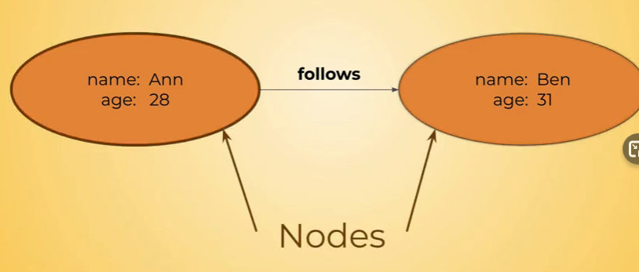
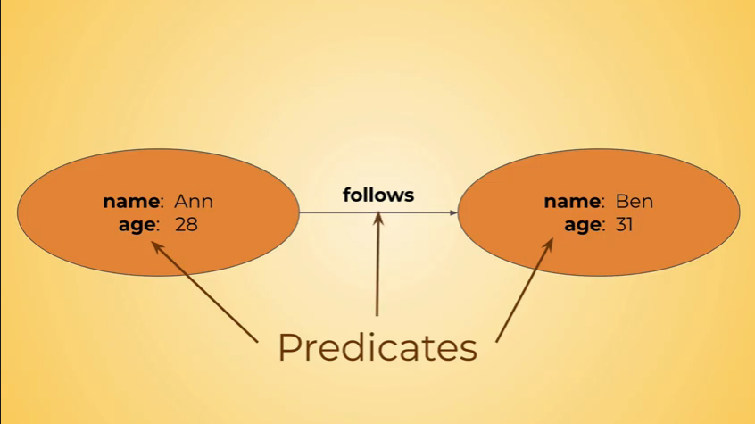

# dgraph description

This is explanation for dgraph DB, how to run, how to use and ...

## Getting Start

for **development** mode start with standalone image for docker dgraphDB this image is useful for just development environment.

```bash
docker run --rm -it -p 8080:8080 -p 9080:9080 -p 8000:8000 -v ~/dgraph:/dgraph dgraph/standalone:v20.11.1
```

* we will expose 3 different ports:
  * 8000 web-ui
  * 8080 for rest api
  * 9080 for GRPC api

## Fundamentals

* In graph database concept or entities are represented as nodes.
  


* Edge between to entities represented as relation between nodes.

* In this pic we have two properties and they will called Predicates.
* The edge between (in here is follows) will called Predicates as well.
  


## First Commands

### Create

* For create new entities just like pictures in previous sections, we can use following commands:

```bash
{
  "set":
    [
      {
        "name": "Hamid",
        "age": "27",
        "follows":[
          {
          "name":"Natalie",
          "age":"??"
          }
        ]
      }
    ]
}
```

### Query

* This command will create two separated entities, but with connected UID.
* For query for this two commands:

```bash
{
  people(func: has(follows)){
    name
    age
    follows{
      name
    }
  }
}
```

* In this command people is name of query and it is totally optional.

* func has a mount of command you can see them in following link blow:
  * <https://dgraph.io/docs/query-language/functions/#sidebar>

* You can also search by UID like this:

```bash
{
  q(func: uid(0x3<this is id of one node>)){
    name
    age
    follows{
      name
    }
  }
}
```

* If you wanna fetch more node simply give more ids:

```bash
{
  q(func: uid(0x3,0x2)){
    name
    age
    follows{
      name
    }
  }
}
```

* When we have loop relation nodes like this:
  
  * one way and the simplest way to doing a search and traversal you can do like this:

```bash
{
  q(func: uid(0x3,0x2)){
    name
    age
    follows{
      name
      age
      follows{
        name
        age
        follows{
          name
          age
        }
      }
    }
  }
}
```

* another way of doing recursive traversals:
  
```bash
{
  q(func: uid(0x3,0x2)) @recurse(depth:5, loop: true){
    name
    age
    follows{
      name
      age
    }
  }
}
```

### Update

* It is just like Create command but you need pass uid as well:

```bash
{
  "set":
    [
      {
        "uid": "0x3",
        "name": "Hamid",
        "age": "27",
        "follows":[
          {
          "name":"Natalie",
          "age":"??"
          }
        ]
      }
    ]
}
```

### DELETE

* It is just like Create command but you need pass uid as well:
  
```bash
{
  "delete":
    [
      {
        "uid": "0x3"
      }
    ]
}
```

* If we just remove relation follows we can do this:
  
```bash
{
  "delete":
    [
      {
        "uid": "0x2",
        "follows":[
          {
            "uid": "0x3"
          }
        ]
      }
    ]
}
```


